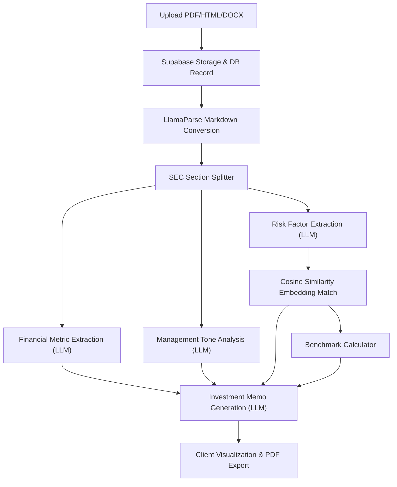

# Signal Intelligence — AI Financial Document Analyst

<div align="center">


</div>

---

# Project Overview
 
**Signal Intelligence** is an AI-powered financial document analysis platform that ingests SEC filings (10-K, 10-Q) and earnings call transcripts, automatically extracts structured financial data, analyzes management tone, identifies risk factors, benchmarks competitors, and generates institutional-grade investment memos.

The system handles:

* PDF/HTML/DOCX document ingestion
* SEC 10-K/10-Q section parsing
* Financial metric extraction (revenue, EBITDA, margins, cash flow, debt)
* Management tone analysis (sentiment, confidence, hedging)
* Risk factor extraction & cross-period comparison
* Competitor benchmarking across companies
* Investment memo generation (bull case, bear case, key risks)

Built with Next.js 16, TypeScript, Supabase (PostgreSQL + Storage), and Nvidia NIM (Llama 3.3 70B), the platform emphasizes:

* deterministic document sectioning (no RAG)
* vector-based risk similarity matching
* real-time pipeline status updates
* configurable LLM rate limiting
* structured audit trails for every pipeline step
* extensible architecture for additional filing types

---

# Core Features

## Document Ingestion

* PDF parsing via LlamaParse (layout-aware Markdown)
* HTML and DOCX document support
* SEC 10-K/10-Q section splitting (26+ standardized headers)
* Earnings transcript section parsing
* 50MB file size limit support
* Supabase Storage integration

---

## Financial Metric Extraction

* Revenue, cost of revenue, gross profit extraction
* EBITDA, operating income, net income
* Cash flow metrics: operating cash flow, free cash flow, capex
* Balance sheet: total debt, net debt, cash & equivalents
* Per-share: EPS basic/diluted, shares outstanding
* Guidance ranges (revenue, EPS, EBITDA)
* YoY and QoQ growth comparisons
* Structured table display with raw text citations

---

## Management Tone Analysis

* Sentiment scoring (0.0–1.0)
* Confidence level assessment
* Hedging language detection
* Overall tone classification (cautious, confident, neutral, defensive, optimistic)
* Key phrase extraction with context
* Notable passage identification
* Period-over-period tone shift detection

---

## Risk Factor Extraction & Comparison

* Individual risk factor extraction from Item 1A sections
* Risk categorization (regulatory, market, operational, financial, cyber, etc.)
* Severity assessment (critical, high, medium, low, informational)
* Cross-period vector similarity matching via embedding cosine similarity
* Automated change classification (new, escalated, deescalated, unchanged, removed)
* Visual diff indicators for new and escalated risks

---

## Competitor Benchmarking

* Cross-company metric comparison table
* Computed metrics: margins, growth rates, ROIC, leverage ratios
* Bar chart visualization for revenue vs. net income
* Auto-populated from extracted financial data
* Sortable by fiscal year and benchmark group
* Up to 3 companies side-by-side comparison

---

## Investment Memo Generation

* Structured memo with 6 sections
* Company overview (business model, market position)
* Financial summary (trends, margins, cash flow)
* Bull case (data-grounded investment thesis)
* Bear case (headwinds and concerns)
* Key risks with severity evaluation
* Questions to investigate for management
* Evidence references with source citations
* PDF export via html2pdf.js

---

# Project Structure

```txt
├── sample_data/
│   └── acme_10k.html
│
├── src/
│   ├── actions/
│   │   ├── fetch-metrics.ts
│   │   └── upload-document.ts
│   │
│   ├── app/
│   │   ├── api/
│   │   │   ├── companies/[id]/route.ts
│   │   │   ├── documents/[id]/route.ts
│   │   │   ├── parse/route.ts
│   │   │   └── test/route.ts
│   │   │
│   │   ├── benchmarks/page.tsx
│   │   ├── companies/
│   │   │   ├── page.tsx
│   │   │   └── [id]/page.tsx
│   │   ├── compare/page.tsx
│   │   ├── documents/
│   │   │   ├── page.tsx
│   │   │   └── [id]/page.tsx
│   │   ├── tests/page.tsx
│   │   ├── error.tsx
│   │   ├── globals.css
│   │   ├── layout.tsx
│   │   ├── loading.tsx
│   │   ├── not-found.tsx
│   │   └── page.tsx
│   │
│   ├── components/
│   │   ├── documents/
│   │   │   ├── document-list.tsx
│   │   │   ├── document-viewer.tsx
│   │   │   ├── dropzone.tsx
│   │   │   ├── pdf-viewer.tsx
│   │   │   └── pipeline-progress.tsx
│   │   ├── layout/
│   │   │   ├── app-shell.tsx
│   │   │   ├── header.tsx
│   │   │   ├── sidebar.tsx
│   │   │   └── split-pane.tsx
│   │   └── ui/
│   │       ├── badge.tsx
│   │       ├── button.tsx
│   │       ├── card.tsx
│   │       ├── skeleton.tsx
│   │       └── tabs.tsx
│   │
│   ├── hooks/
│   │   └── use-document.ts
│   │
│   └── lib/
│       ├── nim/
│       │   ├── client.ts
│       │   ├── rate-limiter.ts
│       │   └── prompts/
│       │       ├── analyze-tone.ts
│       │       ├── extract-metrics.ts
│       │       ├── extract-risks.ts
│       │       └── generate-memo.ts
│       ├── parser/
│       │   ├── llamaparse.ts
│       │   └── section-splitter.ts
│       ├── pipeline/
│       │   └── orchestrator.ts
│       ├── rate-limit/
│       │   └── api-rate-limiter.ts
│       ├── supabase/
│       │   ├── admin.ts
│       │   ├── client.ts
│       │   └── server.ts
│       ├── tests/
│       │   └── test-suite.ts
│       └── utils/
│           ├── constants.ts
│           ├── formatters.ts
│           └── types.ts
│
├── supabase/
│   └── schema.sql
│
├── capture.js
├── generate_pdf.js
├── setup_db.js
├── test_upload.js
├── .gitignore
├── eslint.config.mjs
├── next.config.ts
├── package.json
├── postcss.config.mjs
└── tsconfig.json
```

---

# Key Directories Explained

## `src/app/`

Next.js App Router pages and layouts.

### `api/`

Backend API routes:

| Route              | Method | Purpose                     | Rate Limit      |
| ------------------ | ------ | --------------------------- | --------------- |
| `/api/parse`       | POST   | Upload filing + start pipeline | 5 req/min/IP    |
| `/api/documents/[id]` | DELETE | Delete document and files   | 10 req/min/IP   |
| `/api/companies/[id]` | DELETE | Delete company and all data | 10 req/min/IP   |
| `/api/test`        | GET    | Run test suite              | Unlimited       |

### Page Routes

| Route                     | Purpose                         |
| ------------------------- | ------------------------------- |
| `/`                       | Dashboard with stats + upload   |
| `/documents`              | Document list + upload          |
| `/documents/[id]`         | Document detail (4 tabs)        |
| `/companies`              | Company list + compare selector |
| `/companies/[id]`         | Company filing history          |
| `/benchmarks`             | Competitor benchmarking table   |
| `/compare`                | Side-by-side company comparison |
| `/tests`                  | Test suite UI                   |

---

## `src/lib/`

Core infrastructure and reusable logic.

| Folder                  | Purpose                                 |
| ----------------------- | --------------------------------------- |
| `nim/`                  | Nvidia NIM API client + rate limiter    |
| `nim/prompts/`          | LLM prompt templates for each pipeline step |
| `parser/`               | LlamaParse client + SEC section splitter |
| `pipeline/`             | Sequential processing orchestrator      |
| `rate-limit/`           | HTTP API rate limiter (IP-based)        |
| `supabase/`             | Database clients (browser, server, admin) |
| `tests/`                | Unit test suite                         |
| `utils/`                | Types, constants, formatters            |

---

## `src/components/`

React components organized by domain.

| Directory    | Responsibility                     |
| ------------ | ---------------------------------- |
| `documents/` | File upload, viewer, pipeline UI   |
| `layout/`    | Shell, sidebar, header, split pane |
| `ui/`        | Badge, button, card, skeleton, tabs |

---

# System Architecture

Signal Intelligence follows a sequential pipeline architecture driven by LLM extraction.

## Processing Pipeline

```txt
Upload PDF/HTML
    ↓ (via /api/parse)
LlamaParse → Markdown
    ↓
SEC Section Splitter
    ↓
Financial Metric Extraction (LLM)
    ↓
Management Tone Analysis (LLM) per section
    ↓
Risk Factor Extraction (LLM) from Item 1A
    ↓
Risk Comparison via Vector Embeddings (cosine similarity)
    ↓
Competitor Benchmark Population
    ↓
Investment Memo Generation (LLM)
    ↓
Pipeline Complete
```

## Core Domains

| Domain        | Responsibility                       |
| ------------- | ------------------------------------ |
| Ingestion     | File upload, LlamaParse parsing      |
| Sectioning    | Deterministic SEC header splitting   |
| Extraction    | LLM-based financial metric parsing   |
| Tone          | Sentiment, confidence, hedging analysis |
| Risks         | Risk categorization + cross-period comparison |
| Benchmarks    | Cross-company metric normalization   |
| Memo          | Structured memo generation           |

---

# Pipeline Architecture

Each pipeline run is tracked with full auditability.

## Pipeline Steps

| Step                | Description                     | LLM Call |
| ------------------- | ------------------------------- | -------- |
| `parse`             | PDF → Markdown via LlamaParse   | No       |
| `section`           | Split by SEC headers            | No       |
| `extract_metrics`   | Extract financial figures       | Yes      |
| `analyze_tone`      | Analyze management commentary    | Yes      |
| `extract_risks`     | Extract and categorize risks    | Yes      |
| `compare_risks`     | Vector similarity matching      | No (embeddings) |
| `generate_embeddings` | Store vector embeddings + benchmarks | No |
| `generate_memo`     | Generate investment memo        | Yes      |

## Rate Limiting

All LLM calls go through a sequential rate limiter (40 RPM by default) to stay within Nvidia NIM API limits. HTTP API routes also have IP-based rate limiting:

* Uploads: 5 requests/minute/IP
* Mutations: 10 requests/minute/IP

---

# Application Workflow

Signal Intelligence implements an automated, sequential pipeline that processes uploaded documents, extracts intelligence using LLM prompts, and serves analysis on the frontend:



### 1. Ingestion & Pre-processing
* **User Input**: Analysts upload filings (10-K/10-Q) or transcripts via the frontend dropzone. The request specifies metadata such as Company Name, Ticker, Fiscal Year, and Quarter.
* **Storage & DB Entry**: Files are stored in the Supabase Storage bucket (`documents`). The company is upserted into the `companies` table, and a tracking record is created in the `documents` table with status `uploaded`.

### 2. Parse & Section Split
* **Markdown Conversion**: The system passes the file to [llamaparse.ts](file:///c:/Users/ASUS/Downloads/Signal-main/Signal-main/src/lib/parser/llamaparse.ts) which utilizes LlamaParse to convert PDFs to layout-aware Markdown format, maintaining tables and structured data.
* **SEC Header Splitting**: The parsed markdown is split into individual sections by [section-splitter.ts](file:///c:/Users/ASUS/Downloads/Signal-main/Signal-main/src/lib/parser/section-splitter.ts) using regex mapping for 26+ standard headers (e.g. *Item 1A. Risk Factors*). The sections are saved to the `document_sections` database table.

### 3. Metric Extraction & Sentiment Analysis
* **Metric Extraction**: Financial and discussion sections are passed to **Nvidia NIM (Llama 3.3 70B)** using prompts defined in [extract-metrics.ts](file:///c:/Users/ASUS/Downloads/Signal-main/Signal-main/src/lib/nim/prompts/extract-metrics.ts). The LLM extracts figures (Revenue, Net Income, EBITDA, Debt, FCF) with text citations, saving them to the `financial_metrics` table.
* **Tone Analysis**: Relevant sections are evaluated for sentiment, confidence level, and hedging language frequency using prompts from [analyze-tone.ts](file:///c:/Users/ASUS/Downloads/Signal-main/Signal-main/src/lib/nim/prompts/analyze-tone.ts). Output is logged in the `tone_analyses` table.

### 4. Risk Factors & Cross-Period Comparison
* **Risk Extraction**: Individual risk factors are parsed from Item 1A, categorized, and assigned severity scores using prompts from [extract-risks.ts](file:///c:/Users/ASUS/Downloads/Signal-main/Signal-main/src/lib/nim/prompts/extract-risks.ts), then stored in `risk_factors`.
* **Cosine Similarity Match**: If a prior year's filing exists for the company, the system generates embeddings for all current and prior risk factors using `nvidia/nv-embedqa-e5-v5` embeddings.
* **Change Classification**: Dot-product cosine similarity is computed between vectors. Pairs with similarity > `0.7` are matched and analyzed. The system classifies changes into:
  * `new` (no match found in prior filing)
  * `escalated` / `deescalated` (severity increased or decreased)
  * `unchanged` (same risk level and content)
  * `removed` (present in prior filing but absent in current)
  * Updates are written to the `risk_comparisons` database table.

### 5. Benchmark Calculation & Memo Generation
* **Competitor Benchmarking**: Performance indicators like margins, net debt / EBITDA, CapEx / revenue, and estimated ROIC are calculated and upserted into the `competitor_benchmarks` table under a shared benchmark group.
* **Investment Memo**: The system compiles extracted metrics, tone summaries, and risk comparisons into a final prompt from [generate-memo.ts](file:///c:/Users/ASUS/Downloads/Signal-main/Signal-main/src/lib/nim/prompts/generate-memo.ts). **Llama 3.3 70B** compiles an institutional-grade investment memo across 6 sections (Overview, Financials, Bull Case, Bear Case, Key Risks, Questions). The output is written to `investment_memos`.

### 6. Presentation & Client-Side PDF Export
* **Dashboard Tab Layout**: The user reviews the document under four tabs on `/documents/[id]`: Document Viewer (original vs. Markdown split pane), Financial Metrics (tables + citations), Risk Analysis (diff list showing similarity matching and severity changes), and the Investment Memo.
* **PDF Export**: The generated investment memo is compiled and exported as a clean PDF using `html2pdf.js`.

---

# Tech Stack

| Layer             | Technology                          |
| ----------------- | ----------------------------------- |
| Framework         | Next.js 16.2                        |
| Language          | TypeScript 5                        |
| Database          | Supabase (PostgreSQL)               |
| ORM               | Supabase JS Client (type-safe)      |
| Vector DB         | pgvector (1024-dim HNSW indexes)    |
| LLM API           | Nvidia NIM (Llama 3.3 70B)          |
| Embeddings        | Nvidia NV-EmbedQA-E5-V5 (1024d)     |
| PDF Parsing       | LlamaParse                          |
| Styling           | Tailwind CSS 4                      |
| UI Components     | Custom (lucide-react icons)         |
| PDF Viewer        | react-pdf / pdfjs-dist              |
| Charts            | Recharts                            |
| File Upload       | react-dropzone                      |
| PDF Export        | html2pdf.js                         |
| Auth (future)     | Supabase Auth (schema ready)        |
| Package Manager   | npm                                 |

---

# Getting Started

## Prerequisites

* Node.js 18+
* A Supabase project (PostgreSQL + Storage)
* A Nvidia NIM API key (or OpenAI-compatible endpoint)
* A LlamaParse API key

---

# Quick Start

```bash
# Clone repository
git clone <repo-url>

cd Signal

# Install dependencies
npm install

# Configure environment variables
# Create .env.local with required keys (see below)

# Run Supabase SQL schema
# Execute supabase/schema.sql in your Supabase SQL Editor

# Set up storage bucket and realtime
node setup_db.js

# Start development server
npm run dev
```

---

# Environment Variables

```env
# Supabase
NEXT_PUBLIC_SUPABASE_URL=
NEXT_PUBLIC_SUPABASE_PUBLISHABLE_KEY=
SUPABASE_SERVICE_ROLE_KEY=

# Direct PostgreSQL connection (for setup_db.js)
DATABASE_POOLED_URL=

# Nvidia NIM (OpenAI-compatible)
NVIDIA_NIM_API_KEY=
NVIDIA_NIM_BASE_URL=https://integrate.api.nvidia.com/v1
NVIDIA_NIM_MODEL=meta/llama-3.3-70b-instruct
NVIDIA_NIM_EMBEDDING_MODEL=nvidia/nv-embedqa-e5-v5
NVIDIA_NIM_RPM_LIMIT=40

# LlamaParse
LLAMA_CLOUD_API_KEY=

# App URL (for server-side fetch)
NEXT_PUBLIC_APP_URL=http://localhost:3000
```

---

# Development Roadmap

## Phase 1 (Current)

* Document ingestion (PDF, HTML, DOCX)
* SEC section splitting
* Financial metric extraction
* Basic metrics display table

## Phase 2 (Current)

* Management tone analysis with scoring
* Risk factor extraction and categorization
* Vector embedding generation
* Investment memo generation

## Phase 3 (Current)

* Cross-period risk comparison (cosine similarity)
* YoY metric comparison display
* Competitor benchmark auto-population
* Company comparison dashboard

## Phase 4 (Planned)

* Authentication and RLS policies
* User-specific workspaces
* Export reports (PDF download)
* Batch document processing
* Real-time pipeline notifications
* Custom benchmark groups

---

# Future Scope

Signal Intelligence is designed to evolve into a comprehensive financial analysis platform.

Potential future modules:

* Earnings call transcript analysis with Q&A parsing
* Multi-language filing support (International filings)
* Custom metric definitions (user-defined KPIs)
* Portfolio-level aggregation
* Backtesting against actual market outcomes
* SEC EDGAR direct ingestion (CIK-based auto-fetch)
* Alert system for material changes in filings
* Collaborative memo editing with versioning
* Integration with financial data APIs (Bloomberg, Alpha Vantage)

---

# License

This project is licensed under the MIT License.

Copyright (c) 2026 Signal Intelligence
